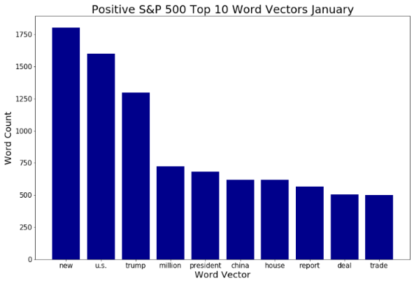
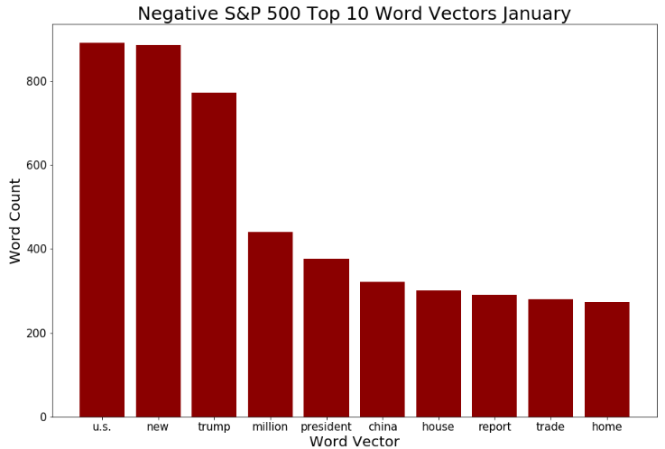
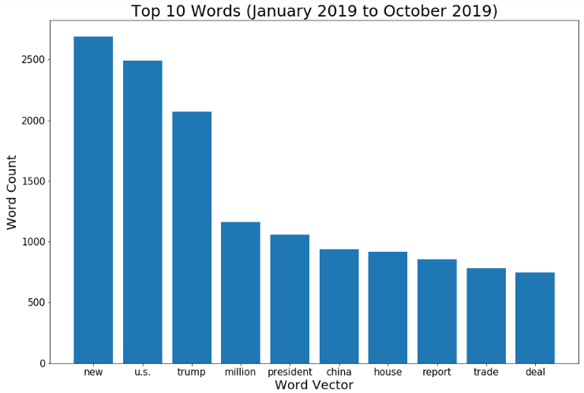
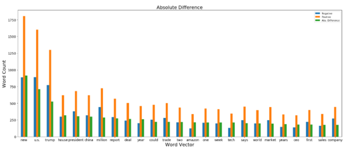
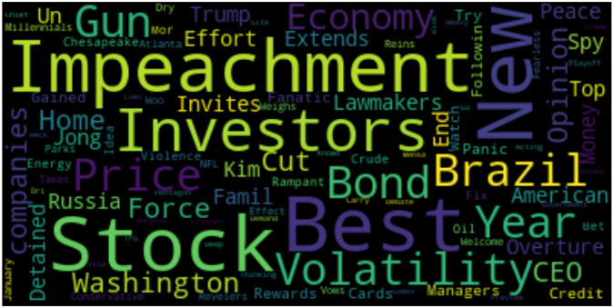
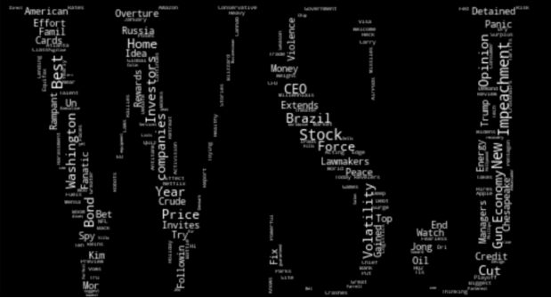
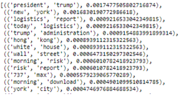

# WSJ NLP S&P500 Market Predictor

The following outlines my capstone project for the Flatiron Data Science bootcamp. Outlines the approach, obtaining/cleaning data, and modeling. I hope you enjoy! 

Originally the first idea was to create a classification model for newspaper/media websites to decide whether the article or headline was right leaning or left leaning.   

With my interest in the financial markets/economy I decided to tweak the project a bit. Two things changed, first only one newspaper was selected to predict data. Second, the classification of the text data was changed. The object that was classified changed from the political spectrum to the direction of the S&P 500 market.  

The project can be summarized as using NLP to analyze text data scraped from the WSJ homepage to predict the following days direction of the S&P 500.

## Data Sources

__Data Sources__
1. The WSJ website was used as the primary source for the text data using the waybackmachine to obtain all historical headlines/homepages
2. The S&P 500 data was taken from yahoo finance in the form of a CSV file (Link: https://finance.yahoo.com/quote/%5EGSPC/history/)

__Python Packages__

1. Beautiful Soup: Simple web scraping tool to easily pull down all html from the waybackmachine wsj historical webpages
2. Selenium: Automated web driver to navigate through the waybakcmachine website

## EDA

### Word Frequency

Using the scrapped text data, word frequency distributions were taken for positive, negative, and total text data.
Unfortunately there is really not much of a difference between the three graphs.

To further investigate, absolute difference of positive vs. negative word frequencies were compared. 

There is not much of a difference here. Note Amazon is mentioned here as the 14th ranked absolute difference word frequency distribution. 

### Word Clouds

One of the best ways to visualize text data is to use a word cloud which can be seen below:

Some words that may be of interest here would be Impeachment (surprise surprise), Gun, Brazil, Kim (North Korea), and Volatility. There are a lot of financial words/jargon along with it politcal topics of 2019.  

Another cool way to represent text data is to insert words into images found online. Below, the WSJ logo was used to create another word cloud of the text data. 

### Bigrams

Lastly, after tokenizing the data, the bigraming technique was used to see which words are highly correlated to one another. The number one bigram is not suprisng in the least! A interesting bigram is the 737 max pair, as this is in leui of the bug in the 737 max airplane.. 

Turns out, using the bigrams as vectors to perform logistic regression yieled the highest base line model with a accuracy of 69 percent.

## Modeling 

Nerual Networks are computer systems modeled on the idea of the human brain and nervous system. In the most basic definition, data is fed into the system which is transformed into vectors. From these vectors the hidden vector is fed which then feeds the  output layer. Neural networks can be as basic as having one hidden layer to a multidue of hidden layers. 

The optimal model had five hidden layers to it. The model used a LSTM layer along with four dense layers, yielding a accuracy of 65%
